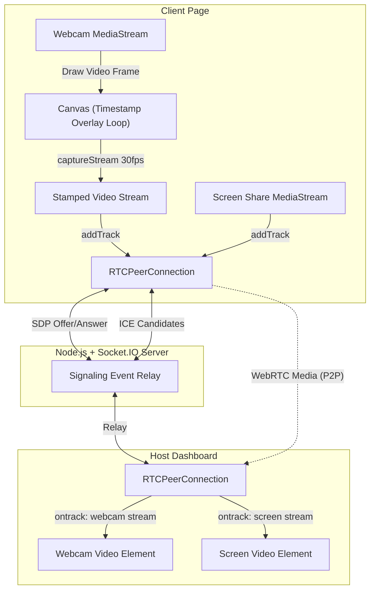

# DualStream — Real-Time Dual Stream Live Video Application

DualStream is a production-ready, low-latency web application designed to capture, process, and stream **both a user's webcam and their screen share simultaneously** to a remote host dashboard in real time. 

A core feature is the **Timestamp Overlay Pipeline**, which permanently burns a live digital timestamp (`HH:MM:SS`) directly into the webcam video pixels using an HTML5 Canvas container before transmission. This ensures that the host sees the timestamp embedded natively inside the incoming video feed, providing an untamperable audit trail.

---

## 📋 Use Cases

This dual-stream real-time architecture is perfect for the following scenarios:

1. **Online Examination & Proctoring**:
   - **How it helps**: Monitors the student's webcam (face/environment) and screen simultaneously to prevent cheating.
   - **Why the timestamp matters**: The burned-in timestamp provides an untamperable temporal record, verifying that the screen and face feeds match the exact elapsed exam period.

2. **Remote Technical Support**:
   - **How it helps**: A support engineer (host) can view the client's screen and their face side-by-side to troubleshoot system issues, offering a personalized and highly collaborative experience.

3. **Live Webinars & Virtual Presentations**:
   - **How it helps**: Presenters share their screen (slides or live coding) while displaying their webcam face feed side-by-side without needing specialized external encoder software like OBS.

4. **Remote Technical Interviews & Coding Assessments**:
   - **How it helps**: Interviewers can monitor candidates solving coding challenges in real time, observing both their screen action and facial reactions.

5. **Virtual Learning & Classrooms**:
   - **How it helps**: Instructors can view students' screens during hands-on lab exercises to guide them dynamically.

---

## ⚙️ How It Works (Technical Flow)

The application separates concerns into a **Client Capture & Processing Interface**, a **Signaling Relay Server**, and a **Host Dashboard**.



### 1. Media Processing & Timestamp Overlay (Client-Side)
- The raw webcam feed (`getUserMedia`) is attached to a hidden `<video>` element.
- A high-performance `requestAnimationFrame` loop copies frames from this hidden video to a `<canvas>` element at the monitor's refresh rate.
- Every frame, the canvas overlays the current time formatted as `HH:MM:SS` inside a dark, semi-transparent background bubble for legibility.
- The canvas video track is extracted via `canvas.captureStream(30)` (30 FPS) and combined with the original audio tracks.
- The screen share stream is captured directly via `getDisplayMedia`.

### 2. Multi-Track WebRTC Transport
- Both the stamped webcam stream and the screen share stream are added to a **single `RTCPeerConnection`** to minimize connection overhead, STUN queries, and bandwidth.
- To differentiate the tracks, metadata mapping their stream IDs to their type (`webcam` vs `screen`) is shared via the signaling channel during negotiation.

### 3. Socket.IO Signaling Server
- Sockets manage the handshake (`offer`, `answer`, `ice-candidate`) in the `"stream-room"`.
- The backend does **no media processing**, ensuring low CPU overhead and high performance. Media flows peer-to-peer (P2P).

### 4. Side-by-Side Rendering (Host-Side)
- The host page listens for incoming WebRTC tracks, extracts the stream type from the signaling metadata, and routes each stream to the proper side-by-side player card.

---

## 🛠️ Tech Stack

- **Frontend**: React 19, Vite, TypeScript, TailwindCSS v4 + Premium Glassmorphism styling.
- **Backend**: Node.js, Express, Socket.IO.
- **Protocol**: WebRTC (Media), Socket.IO (Signaling only).

---

## 📁 Directory Structure

```
project-root/
├── backend/
│   ├── src/
│   │   ├── server.ts              # Express & Socket.IO server startup
│   │   ├── socket/
│   │   │   └── socketHandler.ts   # WebRTC signaling relays
│   │   └── types/
│   │       └── index.ts           # Shared TypeScript interfaces
│   ├── package.json
│   └── tsconfig.json
│
├── frontend/
│   ├── src/
│   │   ├── components/            # Reusable UI components
│   │   │   ├── ConnectionStatus.tsx
│   │   │   ├── TimestampCanvas.tsx # Canvas overlay engine
│   │   │   └── VideoPlayer.tsx
│   │   ├── hooks/                 # WebRTC, Socket and Media Hooks
│   │   │   ├── useScreenCapture.ts
│   │   │   ├── useSocket.ts
│   │   │   ├── useWebcamCapture.ts
│   │   │   └── useWebRTC.ts
│   │   ├── pages/                 # Main Application Layouts
│   │   │   ├── ClientPage.tsx     # Capture & Connect controls
│   │   │   └── HostPage.tsx       # Dual feed dashboard
│   │   ├── services/              # WebRTC and Socket core interfaces
│   │   │   ├── socketService.ts
│   │   │   └── webrtcService.ts
│   │   ├── utils/                 # Utility functions
│   │   │   └── time.ts
│   │   ├── types/
│   │   │   └── index.ts
│   │   ├── App.tsx
│   │   ├── main.tsx
│   │   └── index.css              # Premium custom CSS definitions
│   ├── index.html
│   ├── vite.config.ts
│   └── package.json
│
├── package.json                    # Workspace root configuration
├── README.md
└── METHODOLOGY.md
```

---

## 🚀 How to Run the Project

### Prerequisites
- **Node.js** (version 18 or later)
- **npm** (version 9 or later)
- A working webcam and microphone.

### 1. Installation
In the project root directory, run the following command to install dependencies for both the frontend and backend workspaces:
```bash
npm install
```

### 2. Run in Development
Start both the Express backend and the Vite frontend dev servers concurrently:
```bash
npm run dev
```

The terminal will log the running URLs:
- **Client/Host Interface**: `http://localhost:5173/`
- **Signaling Backend**: `http://localhost:3001`

---

## 💻 Step-by-Step Usage Guide

### Step 1: Open the Host Dashboard
1. Open a browser window to `http://localhost:5173/host`.
2. The page will display **Waiting for Client** with a circular loading animation, checking for socket signals.

### Step 2: Set Up and Connect the Client
1. Open a separate browser window or tab to `http://localhost:5173/client`.
2. Click **Start Webcam**. Accept the browser permissions dialog. You should see your webcam preview, with the live `HH:MM:SS` clock updating in the bottom-right corner.
3. Click **Start Screen Share**. Choose the screen, window, or browser tab you wish to share.
4. Click **Connect to Host**. The connection status indicator will transition from **Ready** → **Connecting...** → **Connected**.

### Step 3: View Streams
- Switch back to the **Host Dashboard** window.
- The two streams (Webcam feed and Screen Share) are now displayed side-by-side with minimal latency.
- The Host is receiving the canvas-processed stream, so the timestamp is natively rendered inside the video.

---

## 🔧 Troubleshooting

- **Camera permissions blocked**: Make sure you permit access to the camera and microphone in your browser bar.
- **Port Conflict (EADDRINUSE)**: If port `3001` or `5173` is already in use, stop the conflicting task or check if another node instance is running in the background.
- **Screen Share Revoked**: If you click the browser's "Stop Sharing" floating button, the client hook will detect it, stop the screen stream, and update the status dynamically. Click "Start Screen Share" again to reload.
- **Localhost Requirement**: WebRTC and `getDisplayMedia`/`getUserMedia` are restricted to secure contexts. They will work on `localhost` or via `https://` secure domains in production.
